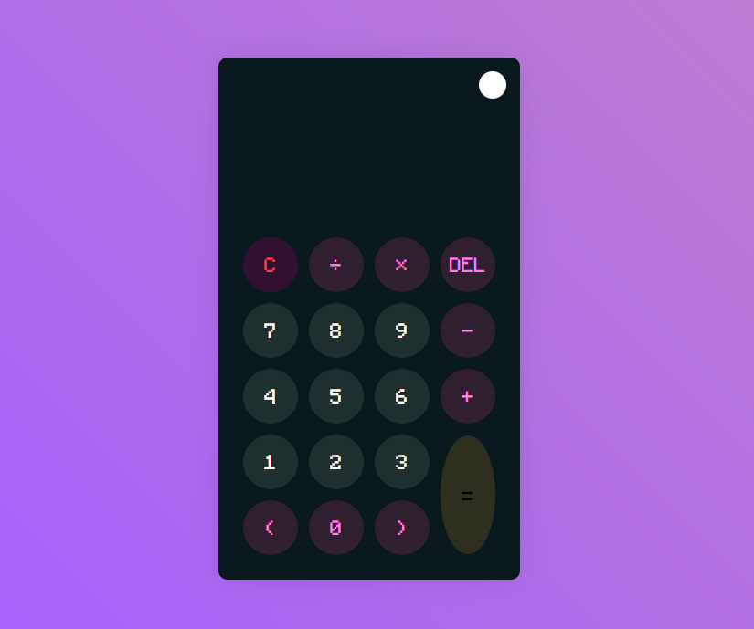

# Calculator with theme Dark/Light

A simple calculator with theme Light and Dark made with HTML, CSS, and JavaScript.

## Overview

This is a functional calculator that allows you to perform basic arithmetic operations. It has a light and dark theme that can be toggled by the user.

## Features

- Addition, subtraction, multiplication, and division
- Clear the screen
- Delete the last digit
- Toggle between light and dark theme

## Screenshots

## Screenshots

### Light Theme


### Dark Theme


## Technologies Used

- HTML
- CSS
- JavaScript

## How to Use

1. Clone the repository:
    ```bash
    git clone https://github.com/PedroAlbelo/calculator.git
    ```

2. Navigate to the project directory:
    ```bash
    cd calculator
    ```

3. Open the `index.html` file in your preferred browser.

## Project Structure

## Author

Created by Pedro Albelo
Contact: albelo.pedrogit@gmail.com

## License

This project is licensed under the MIT License file for details.

--------------

# Calculadora com tema Escuro/Claro

Uma calculadora simples com tema de claro e escuro feita com HTML, CSS e JavaScript.

## Visão Geral

Esta é uma calculadora funcional que permite realizar operações aritméticas básicas. Ela possui um tema claro e escuro que pode ser alternado pelo usuário.

## Funcionalidades

- Adição, subtração, multiplicação e divisão
- Limpar a tela
- Apagar o último dígito
- Alternar entre tema claro e escuro

## Capturas de Tela

### Tema Claro


### Tema Escuro


## Tecnologias Utilizadas

- HTML
- CSS
- JavaScript

## Como Usar

1. Clone o repositório:
    ```bash
    git clone https://github.com/PedroAlbelo/calculator.git
    ```

2. Navegue até o diretório do projeto:
    ```bash
    cd calculator
    ```

3. Abra o arquivo `index.html` no seu navegador preferido.

## Estrutura do Projeto


## Autor

Feito por Pedro Albelo
Contato: albelo.pedrogit@gmail.com

## Licença

Este projeto está licenciado sob a Licença MIT.